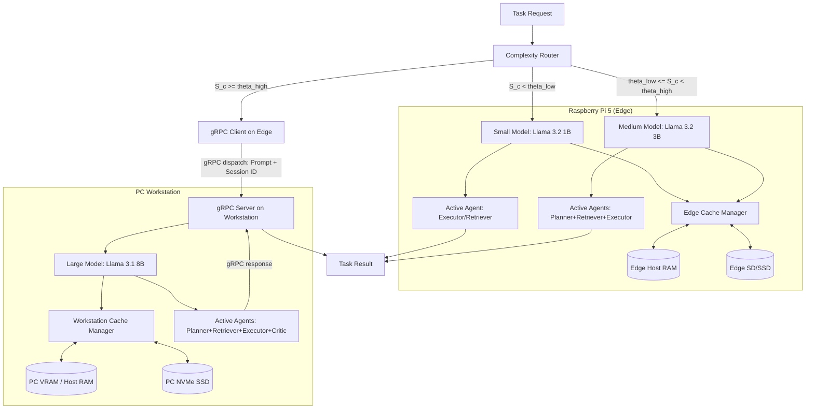

# LiteAgent — Architecture

## 1. System Overview
<TODO — filled in Phase 2>

## 2. Hardware Targets
LiteAgent targets a dual-device co-design environment:
- **PC Workstation**: Intel Core i5-14600K CPU, NVIDIA GeForce RTX 5070 GPU (12 GB VRAM), 32 GB RAM, NVMe SSD (Read ~2.7 GB/s, Write ~2.3 GB/s).
- **Edge Device**: Raspberry Pi 5 (Quad-core Cortex-A76, 8 GB RAM, VideoCore VII GPU). Storage performance is unverified (`TODO: UNVERIFIED`).
For more details, see [hardware_inventory.md](file:///d:/Coding/liteagent/docs/phase0/hardware_inventory.md).

## 3. Model Tiers
We recommend three quantized model tiers running via Ollama:
- **Small (Edge)**: `llama3.2:1b` (~1.3 GB file size, ~2 GB RAM footprint)
- **Medium (Edge/Workstation)**: `llama3.2:3b` (~2.0 GB file size, ~3.5 GB RAM/VRAM footprint)
- **Large (Workstation)**: `llama3.1:8b` (~4.7 GB file size, ~8 GB VRAM footprint)
For more details, see [model_manifest.md](file:///d:/Coding/liteagent/docs/phase0/model_manifest.md).

## 4. Agent Definitions
LiteAgent implements four specialized agent roles to handle target tasks:
- **Planner**: Decomposes user queries into sub-tasks.
- **Retriever**: Fetches relevant passages/context documents.
- **Executor**: Generates code (HumanEval) or performs scratchpad math (GSM8K).
- **Critic**: Reviews execution/reasoning correctness.
For details on inputs/outputs and metrics, see [system_contract.md](file:///d:/Coding/liteagent/docs/phase0/system_contract.md).

## 5. Complexity Router
The Complexity Router dynamically classifies incoming queries into three complexity tiers (Low, Medium, High) using a sub-millisecond logistic regression model that evaluates prompt length, math operators, code syntax flags, and logical density. 
*   **Low Complexity**: Routed to the Small tier (`llama3.2:1b` on Raspberry Pi 5). Bypasses the Planner and Critic agents (only the Executor or Retriever runs).
*   **Medium Complexity**: Routed to the Medium tier (`llama3.2:3b` on Raspberry Pi 5). Bypasses the Critic agent (Planner, Retriever, and Executor cooperate).
*   **High Complexity**: Routed to the Large tier (`llama3.1:8b` on Workstation via gRPC). Runs the full agent loop (Planner, Retriever, Executor, Critic) with no pruning.
The thresholds are derived from a single master parameter $\Theta \in [0.0, 1.0]$ swept during evaluation.

## 6. Three-Tier KV-Cache Manager
The cache manager is built on `llama-cpp-python` / `llama.cpp` serialization primitives (`save_state()` / `load_state()`) which serialize running contexts as binary byte arrays, completely bypassing prefill times.
*   **Hot Cache (VRAM/RAM)**: Holds the active context slot (exactly 1 active slot per model instance to prevent OOM errors).
*   **Standby Cache (Host RAM)**: Stores serialized context bytes in system RAM for fast sub-millisecond swapping.
*   **Cold Cache (SSD)**: Serializes context states to NVMe SSD disk as `.bin` files.
Eviction from Standby RAM to NVMe SSD follows a **Task-Affinity Aware Least Recently Used (TA-LRU)** algorithm, protecting cached contexts of agent roles predicted to be called next.

## 7. Edge–Workstation Communication (gRPC)
Coordination between the edge device and workstation is managed over a lightweight gRPC channel. Due to bandwidth constraints, serialized KV cache states (60–220 MB) are **never** transmitted across the network:
*   At 100 Mbps, transferring a 200 MB state takes **16.0 seconds**, which is 53x slower than GPU prefill.
*   Even at 1 Gbps, transferring takes **1.6 seconds**, which exceeds GPU prefill times.
Instead, the Pi 5 dispatches tasks sending only the prompt text and `session_id`. The workstation resolves the cache key locally, loads the local context state from its NVMe SSD, performs inference, saves the updated state locally, and returns only the output text and performance metrics.

## 8. Data Flow Diagram

## 9. Design Decisions Log
| Decision | Rationale | Phase | Date |
|---|---|---|---|
| Quantization format: GGUF Q4_K_M / Q4_0 | Default quantization for edge deployment to fit small/medium models in local RAM. | 0 | 2026-07-02 |
| Environment and package manager: uv | Standard tool for reproducible environment management and speed. | 0 | 2026-07-02 |
| Small Model: `llama3.2:1b` | Selected for low-latency edge inference on Raspberry Pi 5 CPU. | 0 | 2026-07-02 |
| Medium Model: `llama3.2:3b` | Selected for intermediate reasoning capabilities. Fits comfortably in 8GB Pi RAM and workstation VRAM. | 0 | 2026-07-02 |
| Large Model: `llama3.1:8b` | Swapped from 14B to 8B (Llama 3.1) to preserve VRAM headroom (~7GB free on RTX 5070) for KV-cache tiering experiments and maintain consistency with abstract's "7B/8B tier". | 0 | 2026-07-02 |
| Agent Set: Planner, Retriever, Executor, Critic | Custom architecture matching the core requirements of GSM8K, HotpotQA, and HumanEval. | 0 | 2026-07-02 |
| Formal Research Hypotheses (H1-H4) | Defined to explicitly guide design, routing threshold tuning, and multi-tier cache eviction configurations. | 1 | 2026-07-02 |
| Evaluation Mapping Plan (`evaluation_plan.md`) | Structured to prevent experiment drift and define clear baseline comparators (e.g. static routing, flat cache) for Phase 6. | 1 | 2026-07-02 |
| Engine Choice: `llama-cpp-python` / `llama.cpp` | Bypassed Ollama API to utilize raw state serialization (`save_state()` / `load_state()`) for true three-tier cache swapping. | 2 | 2026-07-04 |
| KV-Cache Local-Only Boundary | Serialized cache states are kept strictly local to each device and never cross the network to avoid severe bandwidth bottlenecks. | 2 | 2026-07-04 |
| Cache Eviction: Task-Affinity Aware LRU (TA-LRU) | Evicts states from RAM to SSD based on both last access time and transition probability between agent roles to prevent thrashing. | 2 | 2026-07-04 |

