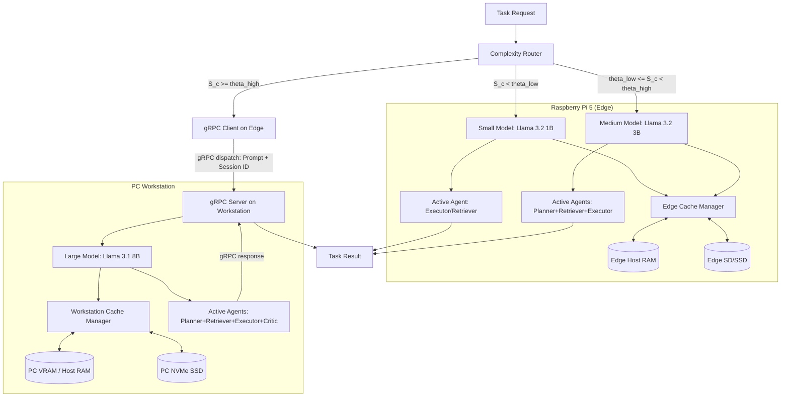

# LiteAgent — Architecture

## 1. System Overview
LiteAgent is a research systems architecture that co-designs complexity-aware routing and a three-tier KV-cache manager for multi-agent LLM workloads deployed across edge-workstation environments. Sub-tasks are dynamically classified by reasoning complexity into Small (`llama3.2:1b`), Medium (`llama3.2:3b`), and Large (`llama3.1:8b`) execution tiers while KV-cache states are managed across local VRAM/RAM, standby host RAM, and NVMe cold storage using Priority-Weighted LRU (PW-LRU) eviction.

## 2. Hardware Targets
LiteAgent targets a dual-device co-design environment:
- **PC Workstation**: Intel Core i5-14600K CPU, NVIDIA GeForce RTX 5070 GPU (12 GB VRAM), 32 GB RAM, NVMe SSD (Read ~2.7 GB/s, Write ~2.3 GB/s).
- **Edge Device**: Raspberry Pi 5 (Quad-core Cortex-A76, 8 GB RAM, VideoCore VII GPU). Storage performance is unverified (`TODO: UNVERIFIED`).
For more details, see [hardware_inventory.md](file:///d:/Coding/liteagent/docs/phase0/hardware_inventory.md).

## 3. Model Tiers
We recommend three quantized model tiers running via Ollama:
- **Small (Edge)**: `llama3.2:1b` (~1.3 GB file size, ~2 GB RAM footprint)
- **Medium (Edge/Workstation)**: `llama3.2:3b` (~2.0 GB file size, ~3.5 GB RAM/VRAM footprint)
- **Large (Workstation)**: `llama3.1:8b` (~4.7 GB file size, ~8 GB VRAM footprint)
For more details, see [model_manifest.md](file:///d:/Coding/liteagent/docs/phase0/model_manifest.md).

## 4. Agent Definitions & Orchestration
LiteAgent implements four specialized agent roles to handle target tasks:
- **Planner**: Decomposes user queries into sub-tasks.
- **Retriever**: Fetches relevant passages/context documents.
- **Executor**: Generates code (HumanEval) or performs scratchpad math (GSM8K).
- **Critic**: Reviews execution/reasoning correctness.
For details on inputs/outputs and metrics, see [system_contract.md](file:///d:/Coding/liteagent/docs/phase0/system_contract.md).

### 4.1. Message Passing
Agents do not call one another directly. Each turn posts a typed message to a
per-task **blackboard** (`src/liteagent/agents/messages.py`), and the next agent
reads it back by type:

| Producer | Message | Consumer |
| :--- | :--- | :--- |
| Planner | `PLAN` | Executor |
| Retriever | `EVIDENCE` | Executor |
| Executor | `DRAFT` | Critic |
| Critic | `CRITIQUE` | Executor (revision only) |

Because the chain is a dataflow graph rather than a fixed call sequence, a pruned
agent simply leaves its message absent and downstream agents degrade instead of
breaking. The full ordered message log is emitted per task as `agent_trace` in the
evaluation record (schema v2), so every reported number is attributable to a
specific agent turn.

### 4.2. Execution Semantics
- **Routing runs once per task.** The complexity score selects both the model tier and the active agent set; every agent turn then executes at that tier (`AgentOrchestrator`, `src/liteagent/agents/orchestrator.py`).
- **Pruning is real.** A pruned agent is never invoked, so the saving is an eliminated model call rather than a bookkeeping entry.
- **The Executor is never pruned.** It is the only agent that produces a scorable answer.
- **The Retriever is only active for document benchmarks** (currently HotpotQA); elsewhere it is pruned as inapplicable.
- **Revision is bounded.** A `REVISE` verdict from the Critic triggers at most `max_revisions` (default 1) additional Executor turns. An unparseable verdict defaults to approval so a malformed critique cannot discard a correct draft.
- **Only the Executor is load-bearing.** A failed Planner, Retriever, or Critic turn is logged and skipped; a failed Executor turn propagates.

### 4.3. Disclosed Asymmetry on HotpotQA
Single-shot baselines receive the full distractor context inlined into the
prompt. The agent chain instead receives the bare question and whatever the
Retriever selects (currently the top 2 paragraphs). This is a genuine system
difference, not a scoring trick, and it cuts both ways: the chain prefills far
fewer tokens, but a retrieval miss removes evidence the baseline still has. Any
HotpotQA comparison must report this alongside the result rather than presenting
the token reduction as a free win.

### 4.4. Why Per-Agent Cache Keys
Each agent turn uses its own cache session key (`{session_id}::{role}`). This is
what gives the PW-LRU policy in §6 distinct entries with distinct role priorities
to choose between — with a single cache entry per task, the role-priority term in
the eviction score would have nothing to discriminate on and H2/H3 would be
degenerate.

## 5. Complexity Router
The Complexity Router dynamically classifies incoming tasks into three model tiers (Small, Medium, Large) using a sub-millisecond Rule-Based Complexity Scorer that evaluates a Weighted Linear Complexity Function:
$$S_c = \sigma(W \cdot X + b)$$
Input features are normalized to $x'_i \in [0.0, 1.0]$ before applying weights, with length normalized via log-scaling to capture the sub-linear relationship between length and complexity. The scorer also computes a routing confidence metric:
$$\text{confidence} = 2.0 \cdot |S_c - 0.5| \in [0.0, 1.0]$$
The router checks score thresholds derived from the master parameter $\Theta \in [0.0, 1.0]$:
*   $\theta_{low} = 0.5 \cdot \Theta$
*   $\theta_{high} = 0.5 + 0.5 \cdot \Theta$
Routing mapping and agent pruning follow:
*   **Low Complexity ($S_c < \theta_{low}$)**: Routed to the Small tier (`llama3.2:1b` on Raspberry Pi 5). Runs the Executor only.
*   **Medium Complexity ($\theta_{low} \leq S_c < \theta_{high}$)**: Routed to the Medium tier (`llama3.2:3b` on Raspberry Pi 5). Runs Planner and Executor; the Critic is pruned.
*   **High Complexity ($S_c \geq \theta_{high}$)**: Routed to the Large tier (`llama3.1:8b` on Workstation via gRPC). Runs Planner, Executor, and Critic.
*   **Retrieval overlay**: for document-bearing benchmarks (HotpotQA) the Retriever is added to the active set at every tier; for all other benchmarks it is pruned as inapplicable. The Executor is never pruned at any tier.
Every decision generates a `routing_margin` metric indicating proximity to boundaries, outputs a list of `decision_reasons`, and is written to a structured JSONL log file with hashed prompts for privacy.

## 6. Three-Tier KV-Cache Manager
The cache manager is built on `llama-cpp-python` / `llama.cpp` serialization primitives (`save_state()` / `load_state()`) which serialize running contexts as binary byte arrays, completely bypassing prefill times.
*   **Hot Cache (VRAM/RAM)**: Holds the active context slot (exactly 1 active slot per model instance to prevent OOM errors).
*   **Standby Cache (Host RAM)**: Stores serialized context bytes in system RAM for fast sub-millisecond swapping.
*   **Cold Cache (SSD)**: Serializes context states to NVMe SSD disk as `.bin` files with companion `.json` metadata files containing cache versioning, model tags, and sizing information.
Eviction from Standby RAM to NVMe SSD follows a **Priority-Weighted Least Recently Used (PW-LRU)** algorithm, protecting cached contexts based on static agent role priorities (`Critic` = 1.0, `Executor` = 0.8, `Planner` = 0.5, `Retriever` = 0.3) to safeguard critical reasoning loops.

### KV-Cache Size Scaling Analysis
Empirical calibration of `llama.cpp`'s state serialization reveals that the KV cache state size $S$ scales **linearly with the number of active/evaluated tokens $x$**, rather than the maximum allocated context size $N_{ctx}$:
$$S(x) = O + G \cdot x$$
where:
*   $O$ is the base model metadata overhead (independent of tokens).
*   $G$ is the growth rate in KB per token, which matches the theoretical KV tensor sizes ($G = \text{Layers} \times 2 \times \text{Heads} \times \text{Dimension} \times 2 \text{ bytes (FP16)}$).

Measured parameters:
| Model Tier | Base Overhead ($O$) | Growth Rate ($G$) | Size at 1,000 Tokens | Size at 2,000 Tokens |
|---|---|---|---|---|
| **Small** (`llama3.2:1b`) | 501.4 KB | 32.01 KB/token | 31.75 MB | 63.01 MB |
| **Medium** (`llama3.2:3b`) | 501.7 KB | 112.01 KB/token | 109.88 MB | 219.26 MB |
| **Large** (`llama3.1:8b`) | 501.8 KB | 128.01 KB/token | 125.50 MB | 250.51 MB |

## 7. Edge–Workstation Communication (gRPC)
Coordination between the edge device and workstation is managed over a lightweight gRPC channel. Due to bandwidth constraints, serialized KV cache states (60–220 MB) are **never** transmitted across the network:
*   At 100 Mbps, transferring a 200 MB state takes **16.0 seconds**, which is 53x slower than GPU prefill.
*   Even at 1 Gbps, transferring takes **1.6 seconds**, which exceeds GPU prefill times.
Instead, the Pi 5 dispatches tasks sending only the prompt text, `session_id`, and `request_id`. The workstation resolves the cache key locally, loads the local context state from its local SSD, performs inference, saves the updated state locally, and returns only the output text and performance metrics.

### 1. Protobuf Interface & Versioning
The gRPC service schema (`src/liteagent/network/protos/coordinator.proto`) exposes:
*   `Ping`: Health check and protocol/software compatibility verification (sends `protocol_version` and returns `compatible`, `model_version`, `llama_cpp_version`, and `liteagent_version`).
*   `DispatchTask`: Executes remote High-complexity tasks on the Large-tier workstation.

### 2. Clock-Drift-Independent Latency Profiling: Loopback Baseline
To evaluate communication RTT delay without requiring synchronized edge/workstation system clocks, we track relative local elapsed durations:
$$\text{communication\_overhead\_ms} = \text{client\_e2e} - (\text{client\_serialize} + \text{server\_queue} + \text{server\_compute} + \text{server\_serialize} + \text{client\_deserialize})$$
This residual reports the pure transport/network/scheduling overhead, preventing clock drift from producing negative values. 

In loopback (same-machine) testing, this value was calibrated as a baseline of **4.93 ms**, representing the pure serialization and serialization-framework overhead. Actual physical LAN (Wi-Fi/Ethernet) runs will append TCP handshakes and physical transport RTT overhead to this baseline.

### 3. Policy-Driven Network Fallbacks
If the gRPC client encounters network exceptions or connection timeouts, a configurable `fallback_policy` is triggered:
*   `medium_local`: Gracefully degrades execution to the local Medium-tier model (`llama3.2:3b`) on the edge with local cache swaps, logging a `FALLBACK` event to prevent crash failures.
*   `fail`: Immediately fails the task and propagates a connection exception.
*   `retry_then_medium`: Retries the connection (default = 1 retry) before falling back to `medium_local`.

### 4. Edge Resource Contention & Thread Starvation
When the edge device (Raspberry Pi 5) executes local inference on its CPU, `llama.cpp` saturates all configured cores. To prevent thread starvation of the background gRPC network polling threads (which could lead to connection drops or socket timeouts due to the Python Global Interpreter Lock (GIL)), we enforce:
*   **Thread Allocation**: Local CPU inference thread count must be capped at $N-1$ threads (where $N=4$ is the number of hardware cores on the Pi 5), leaving one core dedicated to handling network buffers and gRPC socket events.
*   **Socket Tuning**: Active TCP keep-alives and generous connection timeout margins are configured on the client stubs.

## 8. Data Flow Diagram

## 9. Design Decisions Log
| Decision | Rationale | Phase | Date |
|---|---|---|---|
| Quantization format: GGUF Q4_K_M / Q4_0 | Default quantization for edge deployment to fit small/medium models in local RAM. | 0 | 2026-07-02 |
| Environment and package manager: uv | Standard tool for reproducible environment management and speed. | 0 | 2026-07-02 |
| Small Model: `llama3.2:1b` | Selected for low-latency edge inference on Raspberry Pi 5 CPU. | 0 | 2026-07-02 |
| Medium Model: `llama3.2:3b` | Selected for intermediate reasoning capabilities. Fits comfortably in 8GB Pi RAM and workstation VRAM. | 0 | 2026-07-02 |
| Large Model: `llama3.1:8b` | Swapped from 14B to 8B (Llama 3.1) to preserve VRAM headroom (~7GB free on RTX 5070) for KV-cache tiering experiments and maintain consistency with abstract's "7B/8B tier". | 0 | 2026-07-02 |
| Agent Set: Planner, Retriever, Executor, Critic | Custom architecture matching the core requirements of GSM8K, HotpotQA, and HumanEval. | 0 | 2026-07-02 |
| Formal Research Hypotheses (H1-H4) | Defined to explicitly guide design, routing threshold tuning, and multi-tier cache eviction configurations. | 1 | 2026-07-02 |
| Evaluation Mapping Plan (`evaluation_plan.md`) | Structured to prevent experiment drift and define clear baseline comparators (e.g. static routing, flat cache) for Phase 6. | 1 | 2026-07-02 |
| Engine Choice: `llama-cpp-python` / `llama.cpp` | Bypassed Ollama API to utilize raw state serialization (`save_state()` / `load_state()`) for true three-tier cache swapping. | 2 | 2026-07-04 |
| KV-Cache Local-Only Boundary | Serialized cache states are kept strictly local to each device and never cross the network to avoid severe bandwidth bottlenecks. | 2 | 2026-07-04 |
| Cache Eviction: Priority-Weighted LRU (PW-LRU) | Evicts states from RAM to SSD based on both last access time and static agent role priorities (`Critic` = 1.0, `Executor` = 0.8, `Planner` = 0.5, `Retriever` = 0.3) to protect critical active agent states. | 2 | 2026-07-04 |
| Weighted Linear Complexity Scorer | Swapped from simple heuristic check rules to a Weighted Linear Complexity Function with sigmoid scaling, providing a continuous score (Sc) and routing confidence metric. | 3 | 2026-07-05 |
| Clock-Drift-Independent Latency Profiling | Subtracts local durations instead of absolute server-client timestamps to isolate network transport overhead from clock drift. | 5 | 2026-07-05 |
| Policy-Driven Fallback Dispatch | Degradation policies (medium_local, fail, retry_then_medium) configured to maintain edge resilience under network failures. | 5 | 2026-07-05 |
| Ablation Configuration Overrides | Implemented `routing_disabled` and `cache_disabled` as dispatcher toggles to verify component contributions on identical code paths. | 6 | 2026-07-05 |
| Log Parity & Feature Flags | Logs include a `"baseline"` identifier and execution `"feature_flags"` to verify and align all baseline events automatically. | 6 | 2026-07-05 |
| Expected Limit Cache Handling | Classified prefix cache exhaustion under `EXPECTED_LIMIT_REACHED` to distinguish normal capacity bounds from runtime failures. | 6 | 2026-07-05 |
| Context size: 4096 & Timeout: 180s | Increased context size limit to 4096 and gRPC timeout to 180s to prevent out-of-context decode crashes on long HotpotQA prompts and double-eval retry collisions during CPU inference. | 7 | 2026-07-05 |

### Why not Ollama?
Ollama provides convenient high-level inference APIs but does not expose tensor-level model state serialization required for persistent KV-cache research. LiteAgent therefore employs `llama-cpp-python` for model execution while optionally reusing Ollama-managed GGUF assets through the blob resolver to avoid redundant downloads.

## 10. Evaluation Harness & Sandbox Security (Phase 7)
LiteAgent includes a multi-dataset evaluation harness that isolates executions and profiles energy consumption:
- **Metrics Tracked**: Extracts Single-Sample Pass@1 for HumanEval, Exact Match (EM) for GSM8K, and token-level Exact Match & F1 scores for HotpotQA.
- **Subprocess-Level Security Sandboxing**: HumanEval code solutions are executed in isolated Python subprocesses (`python -E -I -S`) with stripped environment variables, strict timeouts, memory limits (RLIMIT_AS), and secondary import/file-write restrictions to prevent unintended system access.

> [!IMPORTANT]
> **A sandbox must be validated in both directions.** Until 2026-09-20 the guard
> installed its import hook before loading any permitted module, so permitted
> imports failed on their transitive dependencies and `from typing import List`
> was rejected. Combined with executing the completion without its prompt, the
> HumanEval metric returned 0.0 for every input — including all 80 reference
> solutions in the subset. The tests only checked that malicious code was
> blocked, which a sandbox that blocks *everything* also satisfies.
>
> The permitted set is now pre-loaded before the hook is installed, and held in
> a closure over a `frozenset` so solution code cannot widen it. `pass@1`
> figures produced before this date are void.

### 10.1a. HumanEval Program Assembly
The prompt supplies the signature, imports and docstring; the model supplies the
body. `build_program()` therefore executes `prompt + completion`, preserving the
body's indentation (stripping it unindents only the first line and raises
`IndentationError` on the next). When a model restates the whole function
instead of continuing it, the completion is used directly and the prompt's
import lines are retained, since restated versions usually drop them.
- **GPU Power Profiling**: Energy consumption is tracked by launching an independent background thread polling `nvidia-smi` every 100ms and integrating power draw over the execution window.

### 10.3. Energy Measurement
Energy backends live in `src/liteagent/eval/energy.py` and are selected with
`--energy-source`. Two invariants hold across all of them:

*   **Unavailable is recorded as `null`, never `0.0`.** A fabricated zero
    averages into results as a real reading. Each record also carries
    `energy_source` naming the backend that produced the number.
*   **A backend refuses to report when it is not measuring the work.** The
    NVIDIA backend is unavailable unless layers are actually offloaded,
    because otherwise it samples an idle card.

| Backend | Pi 5 | Workstation | Comparable across both |
| :--- | :---: | :---: | :---: |
| `nvidia_smi` | no GPU | only with offload (§10.2) | **no** |
| `rapl` | ARM, no RAPL | Windows needs a kernel driver | **no** |
| `external` (wall plug / inline USB-C) | yes | yes | **yes** |

**The external meter is the chosen method.** H4 is a heterogeneous comparison,
so a metric that exists on only one of the two devices cannot support it.
Wall-plug power is also the honest figure for an edge-deployment claim:
GPU-only sampling excludes CPU, RAM, and PSU losses. `system_contract.md` §3.1
already specifies a USB-C meter or smart plug for the Pi, so this makes one
method consistent across the testbed.

> [!IMPORTANT]
> **Historical energy figures are void.** Before 2026-09-20 the harness
> integrated `nvidia-smi` unconditionally while inference ran on the CPU, so
> `energy_joules` tracked the card's ~10 W idle draw — a rescaling of wall-clock
> latency that correlated with latency closely enough to look plausible. No
> energy-per-token result (H1) may be reported from data collected before an
> external meter is in place.

**Sampling-rate caveat.** Consumer meters log at roughly 1 Hz, so a task lasting
a few seconds may contain one sample or none. `ExternalMeterEnergyMonitor`
returns `None` rather than integrating a window with fewer than two samples.
Prefer aggregating energy over a whole benchmark run and dividing by total
tokens generated; per-task energy at this sampling rate is noise.

### 6.1. Tier Residency Is Device-Dependent
The Hot tier is only VRAM when layers are actually offloaded. With the current
CPU configuration (§10.2) nothing is GPU-resident, so the hierarchy is
**RAM/RAM/SSD on both devices**. The Raspberry Pi 5 has no usable GPU in any
case. Until GPU offload works on the workstation, the "three-tier VRAM/RAM/SSD"
description in the abstract and §6 overstates what runs: either restate it as a
two-tier RAM/SSD hierarchy, or scope the VRAM tier to the workstation and only
once offload is enabled.

### 10.1. Prefill Logits Retrieval
The prefill bottleneck came from `logits_all=True`, which materialises logits for
every prompt token. Leaving it at its default and reading only the final token's
logits is what recovered the ~10x prefill speedup.

`InferenceEngine.get_last_logits` reads the low-level pointer
`llama._ctx.get_logits()` first, falling back to `eval_logits` / `_scores` only
for mock instances that have no `_ctx`.

*   **This ordering is load-bearing, not a preference.** Measured on real `Llama`
    instances (2026-09-20, both `0.3.1` and `0.3.4`, CPU and CUDA): with
    `logits_all` left at its default, `eval_logits` and `_scores` both read back
    **all zeros**. Only the context pointer holds decoded values. Reading a
    high-level accessor first makes greedy sampling return `argmax(zeros) == 0`,
    so every generation decodes to `"!!!!!!"` while still looking structurally
    valid to the harness.
*   **Buffer shape:** with `logits_all` disabled llama.cpp exposes only the final
    row, so the pointer must be read as `n_vocab` floats. Reading
    `n_tokens * n_vocab` would run past the end of the buffer.
*   **Dependency note:** this does rely on an internal `llama-cpp-python` context
    API, which may change across versions. That risk is accepted because the
    documented alternative does not work. `tests/utils/test_inference_quality.py`
    is the regression guard: it fails if the zeroed accessors are ever preferred
    again.

### 10.2. GPU Offload Status (investigated 2026-09-20)
Inference currently runs on the **CPU** on both devices. This is a constraint,
not a preference, and it is the reason the energy metric in §10 is invalid.

What was tried on the workstation (RTX 5070, Blackwell, compute capability 12.0,
driver 616.92, CUDA 13.1 toolkit present):

| Step | Result |
| :--- | :--- |
| `llama-cpp-python` 0.3.4 from the `cu124` index | installs; needs the cu12 runtime DLLs, which CUDA 13 does not provide (vendored via `nvidia-*-cu12` pip packages and registered by `liteagent/cuda_setup.py`) |
| `llama_supports_gpu_offload()` | `True`; device detected as compute 12.0 |
| Model load with `n_gpu_layers=-1` | works; VRAM 1080 → 2797 MiB, power 9.5 → 28.8 W |
| Prompt prefill (`eval`) | works (first call pays a one-off PTX JIT cost) |
| `save_state` / `load_state` roundtrip | works; `LlamaState` still carries `seed`, so `cache/serialization.py` is unchanged |
| Decode ≤ 32 tokens | works, output matches CPU byte-for-byte |
| Decode ≥ 64 tokens | **aborts** in `ggml-cuda.cu:70` |
| `GGML_CUDA_DISABLE_GRAPHS=1`, `GGML_CUDA_FORCE_MMQ=1` | no effect |

**Diagnosis.** 0.3.4 is the newest prebuilt CUDA wheel on the official index, and
its vendored llama.cpp predates Blackwell support. Some decode-path kernel has
neither an sm_120 binary nor JIT-compatible PTX, so short generations survive on
the kernels that do resolve while longer ones hit the missing one.

**Options, in preference order.** (1) Build `llama-cpp-python` from source
against a llama.cpp revision with real sm_120 support, using the installed CUDA
13.1 toolkit and `CMAKE_CUDA_ARCHITECTURES=120` — this needs an MSVC toolchain.
(2) Keep CPU inference and measure energy with RAPL or a wall meter, which also
gives a single consistent method across the Pi and the workstation. (3) Report
latency only and drop energy claims.

Offload stays opt-in via `LITEAGENT_WORKSTATION_GPU_LAYERS` so the path can be
re-tested without code changes once a working build exists.

