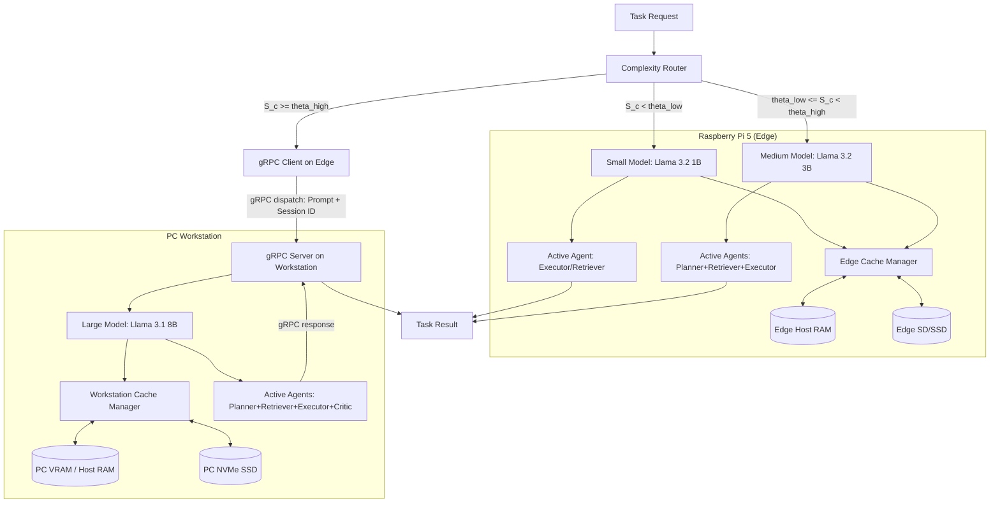

# LiteAgent — Architecture

## 1. System Overview
<TODO — filled in Phase 2>

## 2. Hardware Targets
LiteAgent targets a dual-device co-design environment:
- **PC Workstation**: Intel Core i5-14600K CPU, NVIDIA GeForce RTX 5070 GPU (12 GB VRAM), 32 GB RAM, NVMe SSD (Read ~2.7 GB/s, Write ~2.3 GB/s).
- **Edge Device**: Raspberry Pi 5 (Quad-core Cortex-A76, 8 GB RAM, VideoCore VII GPU). Storage performance is unverified (`TODO: UNVERIFIED`).
For more details, see [hardware_inventory.md](file:///d:/Coding/liteagent/docs/phase0/hardware_inventory.md).

## 3. Model Tiers
We recommend three quantized model tiers running via Ollama:
- **Small (Edge)**: `llama3.2:1b` (~1.3 GB file size, ~2 GB RAM footprint)
- **Medium (Edge/Workstation)**: `llama3.2:3b` (~2.0 GB file size, ~3.5 GB RAM/VRAM footprint)
- **Large (Workstation)**: `llama3.1:8b` (~4.7 GB file size, ~8 GB VRAM footprint)
For more details, see [model_manifest.md](file:///d:/Coding/liteagent/docs/phase0/model_manifest.md).

## 4. Agent Definitions
LiteAgent implements four specialized agent roles to handle target tasks:
- **Planner**: Decomposes user queries into sub-tasks.
- **Retriever**: Fetches relevant passages/context documents.
- **Executor**: Generates code (HumanEval) or performs scratchpad math (GSM8K).
- **Critic**: Reviews execution/reasoning correctness.
For details on inputs/outputs and metrics, see [system_contract.md](file:///d:/Coding/liteagent/docs/phase0/system_contract.md).

## 5. Complexity Router
The Complexity Router dynamically classifies incoming tasks into three model tiers (Small, Medium, Large) using a sub-millisecond Rule-Based Complexity Scorer that evaluates a Weighted Linear Complexity Function:
$$S_c = \sigma(W \cdot X + b)$$
Input features are normalized to $x'_i \in [0.0, 1.0]$ before applying weights, with length normalized via log-scaling to capture the sub-linear relationship between length and complexity. The scorer also computes a routing confidence metric:
$$\text{confidence} = 2.0 \cdot |S_c - 0.5| \in [0.0, 1.0]$$
The router checks score thresholds derived from the master parameter $\Theta \in [0.0, 1.0]$:
*   $\theta_{low} = 0.5 \cdot \Theta$
*   $\theta_{high} = 0.5 + 0.5 \cdot \Theta$
Routing mapping and agent pruning follow:
*   **Low Complexity ($S_c < \theta_{low}$)**: Routed to the Small tier (`llama3.2:1b` on Raspberry Pi 5). Bypasses the Planner and Critic agents (only the Executor or Retriever runs).
*   **Medium Complexity ($\theta_{low} \leq S_c < \theta_{high}$)**: Routed to the Medium tier (`llama3.2:3b` on Raspberry Pi 5). Bypasses the Critic agent (Planner, Retriever, and Executor cooperate).
*   **High Complexity ($S_c \geq \theta_{high}$)**: Routed to the Large tier (`llama3.1:8b` on Workstation via gRPC). Runs the full agent loop (Planner, Retriever, Executor, Critic) with no pruning.
Every decision generates a `routing_margin` metric indicating proximity to boundaries, outputs a list of `decision_reasons`, and is written to a structured JSONL log file with hashed prompts for privacy.

## 6. Three-Tier KV-Cache Manager
The cache manager is built on `llama-cpp-python` / `llama.cpp` serialization primitives (`save_state()` / `load_state()`) which serialize running contexts as binary byte arrays, completely bypassing prefill times.
*   **Hot Cache (VRAM/RAM)**: Holds the active context slot (exactly 1 active slot per model instance to prevent OOM errors).
*   **Standby Cache (Host RAM)**: Stores serialized context bytes in system RAM for fast sub-millisecond swapping.
*   **Cold Cache (SSD)**: Serializes context states to NVMe SSD disk as `.bin` files with companion `.json` metadata files containing cache versioning, model tags, and sizing information.
Eviction from Standby RAM to NVMe SSD follows a **Priority-Weighted Least Recently Used (PW-LRU)** algorithm, protecting cached contexts based on static agent role priorities (`Critic` = 1.0, `Executor` = 0.8, `Planner` = 0.5, `Retriever` = 0.3) to safeguard critical reasoning loops.

### KV-Cache Size Scaling Analysis
Empirical calibration of `llama.cpp`'s state serialization reveals that the KV cache state size $S$ scales **linearly with the number of active/evaluated tokens $x$**, rather than the maximum allocated context size $N_{ctx}$:
$$S(x) = O + G \cdot x$$
where:
*   $O$ is the base model metadata overhead (independent of tokens).
*   $G$ is the growth rate in KB per token, which matches the theoretical KV tensor sizes ($G = \text{Layers} \times 2 \times \text{Heads} \times \text{Dimension} \times 2 \text{ bytes (FP16)}$).

Measured parameters:
| Model Tier | Base Overhead ($O$) | Growth Rate ($G$) | Size at 1,000 Tokens | Size at 2,000 Tokens |
|---|---|---|---|---|
| **Small** (`llama3.2:1b`) | 501.4 KB | 32.01 KB/token | 31.75 MB | 63.01 MB |
| **Medium** (`llama3.2:3b`) | 501.7 KB | 112.01 KB/token | 109.88 MB | 219.26 MB |
| **Large** (`llama3.1:8b`) | 501.8 KB | 128.01 KB/token | 125.50 MB | 250.51 MB |

## 7. Edge–Workstation Communication (gRPC)
Coordination between the edge device and workstation is managed over a lightweight gRPC channel. Due to bandwidth constraints, serialized KV cache states (60–220 MB) are **never** transmitted across the network:
*   At 100 Mbps, transferring a 200 MB state takes **16.0 seconds**, which is 53x slower than GPU prefill.
*   Even at 1 Gbps, transferring takes **1.6 seconds**, which exceeds GPU prefill times.
Instead, the Pi 5 dispatches tasks sending only the prompt text, `session_id`, and `request_id`. The workstation resolves the cache key locally, loads the local context state from its local SSD, performs inference, saves the updated state locally, and returns only the output text and performance metrics.

### 1. Protobuf Interface & Versioning
The gRPC service schema (`src/liteagent/network/protos/coordinator.proto`) exposes:
*   `Ping`: Health check and protocol/software compatibility verification (sends `protocol_version` and returns `compatible`, `model_version`, `llama_cpp_version`, and `liteagent_version`).
*   `DispatchTask`: Executes remote High-complexity tasks on the Large-tier workstation.

### 2. Clock-Drift-Independent Latency Profiling
To evaluate communication RTT delay without requiring synchronized edge/workstation system clocks, we track relative local elapsed durations:
$$\text{communication\_overhead\_ms} = \text{client\_e2e} - (\text{client\_serialize} + \text{server\_queue} + \text{server\_compute} + \text{server\_serialize} + \text{client\_deserialize})$$
This residual reports the pure transport/network/scheduling overhead, preventing clock drift from producing negative values.

### 3. Policy-Driven Network Fallbacks
If the gRPC client encounters network exceptions or connection timeouts, a configurable `fallback_policy` is triggered:
*   `medium_local`: Gracefully degrades execution to the local Medium-tier model (`llama3.2:3b`) on the edge with local cache swaps, logging a `FALLBACK` event to prevent crash failures.
*   `fail`: Immediately fails the task and propagates a connection exception.
*   `retry_then_medium`: Retries the connection (default = 1 retry) before falling back to `medium_local`.

## 8. Data Flow Diagram

## 9. Design Decisions Log
| Decision | Rationale | Phase | Date |
|---|---|---|---|
| Quantization format: GGUF Q4_K_M / Q4_0 | Default quantization for edge deployment to fit small/medium models in local RAM. | 0 | 2026-07-02 |
| Environment and package manager: uv | Standard tool for reproducible environment management and speed. | 0 | 2026-07-02 |
| Small Model: `llama3.2:1b` | Selected for low-latency edge inference on Raspberry Pi 5 CPU. | 0 | 2026-07-02 |
| Medium Model: `llama3.2:3b` | Selected for intermediate reasoning capabilities. Fits comfortably in 8GB Pi RAM and workstation VRAM. | 0 | 2026-07-02 |
| Large Model: `llama3.1:8b` | Swapped from 14B to 8B (Llama 3.1) to preserve VRAM headroom (~7GB free on RTX 5070) for KV-cache tiering experiments and maintain consistency with abstract's "7B/8B tier". | 0 | 2026-07-02 |
| Agent Set: Planner, Retriever, Executor, Critic | Custom architecture matching the core requirements of GSM8K, HotpotQA, and HumanEval. | 0 | 2026-07-02 |
| Formal Research Hypotheses (H1-H4) | Defined to explicitly guide design, routing threshold tuning, and multi-tier cache eviction configurations. | 1 | 2026-07-02 |
| Evaluation Mapping Plan (`evaluation_plan.md`) | Structured to prevent experiment drift and define clear baseline comparators (e.g. static routing, flat cache) for Phase 6. | 1 | 2026-07-02 |
| Engine Choice: `llama-cpp-python` / `llama.cpp` | Bypassed Ollama API to utilize raw state serialization (`save_state()` / `load_state()`) for true three-tier cache swapping. | 2 | 2026-07-04 |
| KV-Cache Local-Only Boundary | Serialized cache states are kept strictly local to each device and never cross the network to avoid severe bandwidth bottlenecks. | 2 | 2026-07-04 |
| Cache Eviction: Priority-Weighted LRU (PW-LRU) | Evicts states from RAM to SSD based on both last access time and static agent role priorities (`Critic` = 1.0, `Executor` = 0.8, `Planner` = 0.5, `Retriever` = 0.3) to protect critical active agent states. | 2 | 2026-07-04 |
| Weighted Linear Complexity Scorer | Swapped from simple heuristic check rules to a Weighted Linear Complexity Function with sigmoid scaling, providing a continuous score (Sc) and routing confidence metric. | 3 | 2026-07-05 |

### Why not Ollama?
Ollama provides convenient high-level inference APIs but does not expose tensor-level model state serialization required for persistent KV-cache research. LiteAgent therefore employs `llama-cpp-python` for model execution while optionally reusing Ollama-managed GGUF assets through the blob resolver to avoid redundant downloads.

